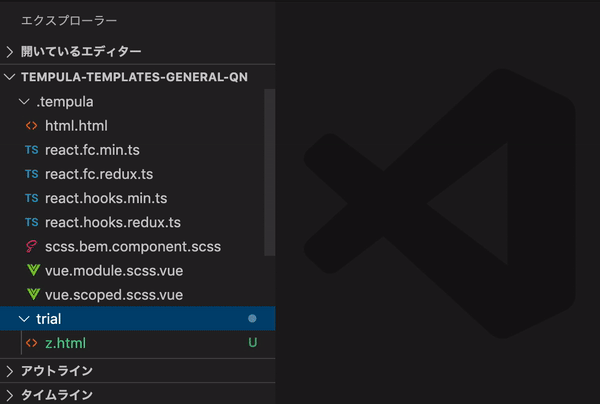

# tempula-vscode extension

##### 予め作っておいたテンプレートファイルを用いて新規ファイルを生成する機能を、フォルダの右クリックメニューに追加する VSCode 拡張



例えば、`TempulaSampleFile`と名付けてこんなテンプレートを適用すると

```
<template>
  <div class="@file-name@-@timestamp@">template</div>
</template>
<script>
export default {
  components: {},
  props: {},
  data() {
    return {};
  },
  methods: {},
};
</script>
<style lang="scss" scoped>
.@file-name@-@timestamp@ {

}
</style>
```

こんな新規ファイルが生成される

```
<template>
  <div class="tempula-sample-file-123456789">template</div>
</template>
<script>
export default {
  components: {},
  props: {},
  data() {
    return {};
  },
  methods: {},
};
</script>
<style lang="scss" scoped>
.tempula-sample-file-123456789 {

}
</style>
```

###### 発音

テンピューラ

# 以下、出来上がったら Atom 向けから書き換え

###### セットアップ

1. この tempula-atom ディレクトリを任意のパスに配置
1. コマンドを実行(どこでも)  
   `apm link そのパス`
1. Atom を再起動するか、`表示 > 開発 > ウィンドウの再読み込み(control + option + command + L)`

- `apm link`で`/Users/<daredare>/.atom/packages`配下にそのパスへのシンボリックリンクが生成される事によって、パッケージをインストールした事と同義になるはず
- atom.io へのパッケージ公開はしない(するにはまだいろいろ足りない)

###### 準備

```
▼ project
├ ▼ .tempula
│ ├ template-full.vue
│ ├ template-light.vue
│ └ template.html
├ □ dist
├ □ node_modules
└ □ source
```

1. プロジェクトルート直下に`.tempula`ディレクトリを作る
1. `.tempula`ディレクトリ配下(サブディレクトリ不可)に、拡張子付き(html ファイルのテンプレートなら`.html`、vue ファイルのテンプレートなら`.vue`)でテンプレートファイルを配置

- 対応している置換文字列
  - @timestamp@: UNIX タイムスタンプに置換
  - @file-name@: ファイル名(拡張子無し)をケバブケースにして置換
  - @file_name@: ファイル名(拡張子無し)をスネークケースにして置換
  - @fileName@: ファイル名(拡張子無し)をキャメルケースにして置換
  - @FileName@: ファイル名(拡張子無し)をパスカルケースにして置換

###### 実行

1. ツリービューで、配下にファイルを生成したいディレクトリを右クリック
1. `New file by tempula`をクリック(すると、サンプル画像のダイアログが表示される)
1. テキストボックスに新規ファイル名(拡張子は不要)を入力
1. テキストボックスの下には`.tempula`ディレクトリ配下のファイル名が(昇順で)表示されるので、適用したいテンプレートファイル名をクリック(すると、テンプレートが適用されて拡張子がテンプレートファイルから引用された新規ファイルが生成される)
1. 終了したい場合は esc

###### 備考

- そもそもプラグインを自作したきっかけは、[Vue.js の scoped CSS における親子間の class 定義の衝突](https://qiita.com/wintyo/items/dfc232255ad45fdf376f)に対する、[CSS Modules](https://qiita.com/mascii/items/3202b9e18fd4a7366ac1)以外による解決を図る必要があったため
- ファイルの連続生成をしたいケースに備えて、ダイアログは即時終了ではなく esc による任意終了にした
- 同じ理由で、ダイアログ終了後も前回の入力値を保持し続ける事にした
  - クリアボタンがあった方が良さそうだが、実装時に思い付かなかった
- 入力されたファイル名(とテンプレートファイルから引用された拡張子の組み合わせ)が既に存在している場合、エラー(上書きや別名ファイルでの生成はしない)
- 入力されたファイル名の末尾にテンプレートファイルと同じ拡張子が付いていた場合
  - その拡張子よりも前までの文字列を、置換文字列に利用
  - テンプレートファイルからの拡張子引用付与はしない
- 置換文字列を使用した場合のファイル名のケース変換規則
  1. 一旦すべてキャメルに変換
  2. 次はケース別
  - パスカル: 先頭を大文字に置換
  - ケバブ・スネーク: 大文字を「記号＋小文字」に置換
    - 例) EMail → e-mail
    - 例) IAEA → i-a-e-a (プログラミング一般論として、この手のイニシャル集合体はそれ自体を 1 単語、例えば Iaea と扱う事が望ましい)
